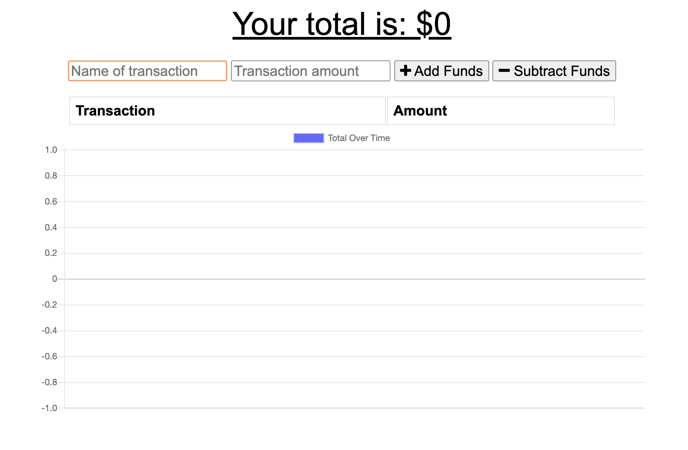

# Online/Offline Budget Trackers

The user will be able to add expenses and deposits to their budget with or without a connection. When entering transactions offline, they should populate the total when brought back online.

Offline Functionality:

- Enter deposits offline

- Enter expenses offline

When brought back online:

- Offline entries should be added to tracker.

## Deployment

Project deployed to Heroku

[Budget Tracker](https://glacial-gorge-46208.herokuapp.com/)

## Screenshot

## License

This project is licensed under the [MIT](https://choosealicense.com/licenses/mit/) License.

## Author

- [@karizmatik215](https://github.com/karizmatik215)
